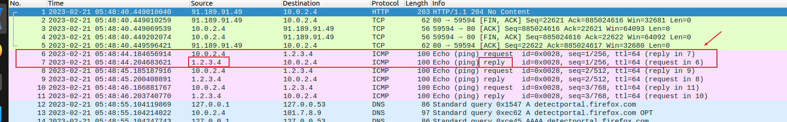

#! https://zhuanlan.zhihu.com/p/608275577
# [SEED LABS Notes] - 课程介绍 & Network Security - Packet Sniffing and Spoofing Lab 


# 1. 课程来源

在网上找计算机课程的时候发现了[SEED LABS](https://seedsecuritylabs.org/index.html)这个网站，SEED LABS是美国Syracuse University大学的Wenliang Du教授创办的实验课程，亮点在于里面有很多动手学习网络安全知识的lab，不仅仅是简单使用网络安全工具，更有自己动手实践的理解工具底层原理的环节，整个内容包括 软件安全、网络安全、web安全、系统安全、密码学、移动安全、区块链等。每个实验都提供了非常详细的实验文档，而且还有视频课（付费的）。作为一个不会网安的网安学生，这个网站对我来说就是福音！打算先从网络安全模块下手，掌握一些基本的网络安全技能。


实验环境的配置非常简单，网站提供了虚拟机镜像文件，和操作手册，安装好就能用。而且实验配置使用docker，文档也提供了详细的使用方法，环境配置容易！能让读者更专注于学知识而不是配环境！这点我很喜欢。

**课程[schedule](https://www.handsonsecurity.net/resources.html)**

**实验环境配置：**

- [我选择在本地virtualbox上用Ubuntu20.04虚拟机](https://seedsecuritylabs.org/labsetup.html)
- [虚拟机详细配置方法](https://github.com/seed-labs/seed-labs/blob/master/manuals/vm/seedvm-manual.md)

**Docker使用：**

- [使用指南](https://github.com/seed-labs/seed-labs/blob/master/manuals/docker/SEEDManual-Container.md)

# 2. Packet Sniffing and Spoofing Lab 做题记录

[本节Lab实验资料](https://seedsecuritylabs.org/Labs_20.04/Networking/Sniffing_Spoofing/)

环境配置按照[Docker manual](https://github.com/seed-labs/seed-labs/blob/master/manuals/docker/SEEDManual-Container.md)在本地虚拟上配置即可，比较简单

## 任务简介

本节主要做数据包的嗅探和欺骗，有两个任务，一是学会使用scapy包嗅探和欺骗工具，二是理解这些技术背后的原理，需要从头编写自己的C程序来进行嗅探和欺骗。

## Lab Task Set 1: Using Scapy to Sniff and Spoof Packets


### Task 1.1: Sniffing Packets

#### Task 1.1A.

```python
# !/usr/bin/env python3
from scapy.all import *

def print_pkt(pkt):
    pkt.show()
    
pkt = sniff(filter='icmp', prn=print_pkt) # 监听所有icmp报文
```

在root用户下，执行该程序，会阻塞，没有任何输出，新开窗口执行 `ping www.baidu.com`，sniffer.py会捕获到以下内容

```
###[ Ethernet ]### 
  dst       = 52:54:00:12:35:00
  src       = 08:00:27:22:1f:7c
  type      = IPv4
###[ IP ]### 
     version   = 4
     ihl       = 5
     tos       = 0x0
     len       = 84
     id        = 45513
     flags     = DF
     frag      = 0
     ttl       = 64
     proto     = icmp
     chksum    = 0xfe96
     src       = 10.0.2.4
     dst       = 182.61.200.7
     \options   \
###[ ICMP ]### 
        type      = echo-request
        code      = 0
        chksum    = 0xd4c8
        id        = 0x9
        seq       = 0x1
###[ Raw ]### 
           load      = '\xef\xd2\xf1c\x00\x00\x00\x00\x80#\x03\x00\x00\x00\x00\x00\x10\x11\x12\x13\x14\x15\x16\x17\x18\x19\x1a\x1b\x1c\x1d\x1e\x1f !"#$%&\'()*+,-./01234567'


....
```

切换到普通用户后，再次执行 sniffer.py程序报错，因为 sniffer 执行到socket.py 的时候需要root权限

```
Traceback (most recent call last):
  File "volumes/sniffer.py", line 7, in <module>
    pkt = sniff(filter='icmp', prn=print_pkt)
  File "/usr/local/lib/python3.8/dist-packages/scapy/sendrecv.py", line 1036, in sniff
    sniffer._run(*args, **kwargs)
  File "/usr/local/lib/python3.8/dist-packages/scapy/sendrecv.py", line 906, in _run
    sniff_sockets[L2socket(type=ETH_P_ALL, iface=iface,
  File "/usr/local/lib/python3.8/dist-packages/scapy/arch/linux.py", line 398, in __init__
    self.ins = socket.socket(socket.AF_PACKET, socket.SOCK_RAW, socket.htons(type))  # noqa: E501
  File "/usr/lib/python3.8/socket.py", line 231, in __init__
    _socket.socket.__init__(self, family, type, proto, fileno)
PermissionError: [Errno 1] Operation not permitted
```

#### Task 1.1B.

嗅探的时候增加过滤条件，只看符合条件的包

scapy的过滤器采用 [BPF(Berkeley Packet Filter)语法](https://biot.com/capstats/bpf.html)

> BPF语法由表达式构成，表达式由 **原语** 和 **运算符**构成，原语由一个id和一个或者多个**限定符**构成
>
> 一共有三种不同的限定符
>
> 1. `type`： 表示id名称或数字指的是什么类型，包含` host, net, port, portrange` 等，比如：`host foo`, `net 128.3`, `port 20`, `portrange 6000-6008`。 如果没有限定符，默认为 `host`
> 2. `dir`：表示来自或者去到id的特定传输方向，包含`src, dst, src or dst and src and dst`，比如 `src foo`, `dst net 128.3`, `src or dst port ftp-data`. 如果没有限定符，默认为 `src or dst`，就是来去的数据包都监听
> 3. `proto`：将匹配限制到特定的协议，包括：`ether, fddi, tr, wlan, ip, ip6, arp, rarp, decnet, tcp and udp`， `ether src foo`, `arp net 128.3`, `tcp port 21`, `udp portrange 7000-7009`， 如果没有原型限定符，则假定与该type一致的所有协议。比如 `src foo`  ==  `(ip or arp or rarp) src foo` (只不过后者不是合法语法), `net bar`  == `(ip or arp or rarp) net bar`  ,  `port 53`  ==  `(tcp or udp) port 53`.
>
> 所有允许的原语有很多，见[文档](https://biot.com/capstats/bpf.html)
>
> 更复杂的过滤器表达式是通过使用单词**and( &&)、or(||)和not(!)**来组合原语来构建的


```python
# !/usr/bin/env python3
from scapy.all import *

def print_pkt(pkt):
    pkt.show()
    
pkt = sniff(filter='icmp', prn=print_pkt) # 抓取ICMP报文
pkt = sniff(filter=' host 182.61.200.6 and (tcp port 23) ', prn=print_pkt) # 查看来自 182.61.200.6这个IP的TCP报文，且限定报文是来自端口号为23
pkt = sniff(filter='dst net 182.61.200', prn=print_pkt) # 监听来自子网 182.61.200.0/24的报文，当我ping 182.61.200.6 的时候sniffer能接收到信息，但是ping 182.61.201.6的时候就不能监听到

```


抓取结果

1. **ICMP报文**

   ```
   # ping www.tsinghua.edu.cn 
   # ping采用ICMP报文
   
   
   ###[ Ethernet ]### 
     dst       = 52:54:00:12:35:00
     src       = 08:00:27:22:1f:7c
     type      = IPv4
   ###[ IP ]### 
        version   = 4
        ihl       = 5
        tos       = 0x0
        len       = 84
        id        = 23668
        flags     = DF
        frag      = 0
        ttl       = 64
        proto     = icmp
        chksum    = 0x275e
        src       = 10.0.2.4
        dst       = 166.111.4.100
        \options   \
   ###[ ICMP ]### 
           type      = echo-request
           code      = 0
           chksum    = 0xa508
           id        = 0xb
           seq       = 0x1
   ###[ Raw ]### 
              load      = 'r-\xf3c\x00\x00\x00\x00\'\x87\x07\x00\x00\x00\x00\x00\x10\x11\x12\x13\x14\x15\x16\x17\x18\x19\x1a\x1b\x1c\x1d\x1e\x1f !"#$%&\'()*+,-./01234567'
   
   ```

2. **来自特定IP且端口号为23**的**TCP报文**

   ```
   # telnet使用的是23端口，在另一个终端输入命令：telnet 182.61.200.6
   # 即可访问182.61.200.6的23端口
   
   
   ###[ Ethernet ]### 
     dst       = 52:54:00:12:35:00
     src       = 08:00:27:22:1f:7c
     type      = IPv4
   ###[ IP ]### 
        version   = 4
        ihl       = 5
        tos       = 0x10
        len       = 60
        id        = 20451
        flags     = DF
        frag      = 0
        ttl       = 64
        proto     = tcp
        chksum    = 0x6081
        src       = 10.0.2.4
        dst       = 182.61.200.6
        \options   \
   ###[ TCP ]### 
           sport     = 58030
           dport     = telnet
           seq       = 2642372733
           ack       = 0
           dataofs   = 10
           reserved  = 0
           flags     = S
           window    = 64240
           chksum    = 0x8a76
           urgptr    = 0
           options   = [('MSS', 1460), ('SAckOK', b''), ('Timestamp', (2983508073, 0)), ('NOP', None), ('WScale', 7)]
   
   ```

3. 抓取来自或者去到**特定子网**的报文

   ```
   # ping 182.61.200.6 
   
   
   
   ###[ Ethernet ]### 
     dst       = 52:54:00:12:35:00
     src       = 08:00:27:22:1f:7c
     type      = IPv4
   ###[ IP ]### 
        version   = 4
        ihl       = 5
        tos       = 0x0
        len       = 84
        id        = 5051
        flags     = DF
        frag      = 0
        ttl       = 64
        proto     = icmp
        chksum    = 0x9ca6
        src       = 10.0.2.4
        dst       = 182.61.200.6
        \options   \
   ###[ ICMP ]### 
           type      = echo-request
           code      = 0
           chksum    = 0x405f
           id        = 0xf
           seq       = 0x1
   ###[ Raw ]### 
              load      = '\xc75\xf3c\x00\x00\x00\x006$\x08\x00\x00\x00\x00\x00\x10\x11\x12\x13\x14\x15\x16\x17\x18\x19\x1a\x1b\x1c\x1d\x1e\x1f !"#$%&\'()*+,-./01234567'
   
   ```

   

### Task 1.2: Spoofing ICMP Packets


可以进入实验环境中的 seed-attacker，也可以直接在本虚拟机中进入root，然后在命令行中写如下代码：

指定IP包的来源是某个IP，我这里用的是百度的一个ip 182.61.200.6，去向是实验环境中的一个主机，这里红的host-B 10.9.0.6，这样就伪造了一个来自182.61.200.6发往10.9.0.6，从下面截图可以看到10.9.0.6对这个ICMP报文进行了回复！

说明我们可以**伪造来自任意源IP地址的报文**，发给主机并收到回复

```shell
>>> from scapy.all import *
>>> a = IP()
>>> a.src = '182.61.200.6' 
>>> a.dst = '10.9.0.6'
>>> a.show()
###[ IP ]### 
  version= 4
  ihl= None
  tos= 0x0
  len= None
  id= 1
  flags= 
  frag= 0
  ttl= 64
  proto= hopopt
  chksum= None
  src= 182.61.200.6
  dst= 10.9.0.6
  \options\

>>> b = ICMP()
>>> p = a/b
>>> send(p)
.
Sent 1 packets.
```

伪造源IP地址的ICMP报文得到了回复


### Task 1.3: Traceroute

本任务的目标是使用Scapy根据路由器的数量来估计VM和所选目的地之间的距离，这就是`traceroute`干的事情，我们自己实现一个`traceroute`

原理很简单，就是我们先设置TTL=1的ICMP报文，这个报文就会在第一个路由器的时候被丢掉，并返回一个ICMP error	信息，我们就能得到第一个路由器的IP；然后设置TTL=2的ICMP报文，得到第二个路由器的IP...直到到达目标。

这里使用到了 `scapy.sr1()`函数来发并收取数据包 [sr1()](https://scapy.readthedocs.io/en/latest/usage.html)可以设置一些参数，`timeout`是超时跳过，`verbose=False`可以禁止输出反馈信息到控制台

```python
from scapy.all import *

# def print_pkt(pkt):
#     pkt.show()

if __name__ == "__main__":
    # pkt = sniff(filte='src 182.61.200.6  and  ICMP', prn = print_pkt)
    
    dst = '182.61.200.6'
    src = ''
    ttl = 1
    a = IP(dst=dst)
    while src != dst:
        
        a.ttl = ttl
        p = sr1(a/ICMP(), timeout=2, verbose=False) # timeout超时退出， verbos=False不输出反馈信息到控制台
        if p != None:
            src = p.src
        else:
            src = "****"
        print('step%-2d:    %-10s' %(ttl, src))
        ttl += 1
        if ttl == 31: break
    
```

root下执行后结果如下：

```
step1 :    10.0.2.1  
step2 :    101.5.128.1
step3 :    172.17.2.17
step4 :    118.229.4.73
step5 :    202.112.38.1
step6 :    101.4.113.233
step7 :    219.224.103.38
step8 :    101.4.130.34
step9 :    182.61.255.28
step10:    182.61.255.47
step11:    ****      
step12:    ****      
step13:    ****      
step14:    ****      
step15:    182.61.200.6
```

同时也可以在wireshark中看到发出去的ICMP报文，以后收到路径上路由器回复的ICMPerror报文


### Task 1.4: Sniffing and-then Spoofing

这个task的工作就是嗅探ICMP报文，不管ICMP报文的地址能不能到达，都返回一个伪造的ICMP  reply报文。我们的目标其实就是根据ICMP的request伪造reply报文。

首先了解以下[ICMP报文的结构](https://blog.csdn.net/u011784495/article/details/71743516)，主要就有类型、代码、标识符、校验和、数据几个字段。然后使用IP报头封装。

我们先用ping能够到达的IP来看看scapy数据包的结构，用Task1.1的嗅探程序。

```python
from scapy.all import *

def print_pkt(pkt):
    pkt.show()
pkt = sniff(filter='icmp', prn=print_pkt)
```

启动这个程序，然后在另一个终端ping 8.8.8.8

得到以下输出：

```
p# python3 volumes/sniffer.py 
###[ Ethernet ]### 
  dst       = 52:54:00:12:35:00
  src       = 08:00:27:22:1f:7c
  type      = IPv4
###[ IP ]### 
     version   = 4
     ihl       = 5
     tos       = 0x0
     len       = 84
     id        = 30008
     flags     = DF
     frag      = 0
     ttl       = 64
     proto     = icmp
     chksum    = 0xa95d
     src       = 10.0.2.4
     dst       = 8.8.8.8
     \options   \
###[ ICMP ]### 
        type      = echo-request
        code      = 0
        chksum    = 0x528c
        id        = 0x26
        seq       = 0x1
###[ Raw ]### 
           load      = '\xb0\x9b\xf4c\x00\x00\x00\x00<z\x05\x00\x00\x00\x00\x00\x10\x11\x12\x13\x14\x15\x16\x17\x18\x19\x1a\x1b\x1c\x1d\x1e\x1f !"#$%&\'()*+,-./01234567'


###[ Ethernet ]### 
  dst       = 08:00:27:22:1f:7c
  src       = 52:54:00:12:35:00
  type      = IPv4
###[ IP ]### 
     version   = 4
     ihl       = 5
     tos       = 0x0
     len       = 84
     id        = 56
     flags     = 
     frag      = 0
     ttl       = 59
     proto     = icmp
     chksum    = 0x635e
     src       = 8.8.8.8
     dst       = 10.0.2.4
     \options   \
###[ ICMP ]### 
        type      = echo-reply
        code      = 0
        chksum    = 0x5a8c
        id        = 0x26
        seq       = 0x1
###[ Raw ]### 
           load      = '\xb0\x9b\xf4c\x00\x00\x00\x00<z\x05\x00\x00\x00\x00\x00\x10\x11\x12\x13\x14\x15\x16\x17\x18\x19\x1a\x1b\x1c\x1d\x1e\x1f !"#$%&\'()*+,-./01234567'

```

上面是两个报文，第一个是request报文，第二个是reply报文。

scapy报文是OSI模型，可以看到ICMP报文的结构是： IP()/ICMP()/Raw

而且我们可以发现：

1.  [ICMP] 这一层次中，request报文和reply报文的 id, code, seq 

2. 而且两个报文的Raw是相同的

因此我们构造ICMP reply这层报文的时候，只需要设置type为echo-reply（或者数字0，具体可看ICMP报文类型），然后把对应的 request报文的 id, code, seq,复制给我们构造的relpy报文即可。IP层我们只需要把源地址和目的地址对调，然后发送出去即可。

实现代码如下，[参考链接](https://blog.csdn.net/weixin_45688580/article/details/108932646)：

```python
from scapy.all import *

def deal_pkt(pkt):

    if pkt.getlayer(ICMP).type == 8: # 8表示echo hello
        # 构建IP()层
        a = IP()
        a.dst = pkt.getlayer(IP).src
        a.src = pkt.getlayer(IP).dst 
        # 构建ICMP()层，注意 request 和 reply的报文，其标识符、代码、序号、Raw都是一样的
        b = ICMP()
        b.type = 0 # 0表示reply
        b.id = pkt.getlayer(ICMP).id # 标识符
        b.code = pkt.getlayer(ICMP).code # 代码
        b.seq = pkt.getlayer(ICMP).seq  # 序号
        str = pkt.getlayer(Raw).load    # 
        p = a/b/Raw(str) 
        send(p)
            
        print('the spoofing pkt #########')
        p.show()

if __name__ == "__main__":
    sniff(filter="icmp", prn=deal_pkt)
```


#### 实验结果：

在VM上运行 上面的监听伪造程序；在其中一个容器中执行ping命令；打开wireshark看ICMP reply报文

```
ping 1.2.3.4  # a non-existing host on the Internet
```



可以看到对ping不存在网址的ICMP请求，也得到了正常的回应

```
ping 10.9.0.99 # a non-existing host on the LAN
```

这个没成功，因为没考虑ARP协议

```
ping 8.8.8.8 # an existing host on the Internet
```

这个不知道有没有成功，对于正常回应的如何用伪造的包替换掉真实的包？

## Lab Task Set 2: Writing Programs to Sniff and Spoof Packets


###  Task 2.1: Writing Packet Sniffing Program


### Task 2.2: Spoofing


###  Task 2.3: Sniff and then Spoof


## 实验总结


## 参考资料

知乎推荐帖子：[SeedProject: 网络安全实验——拒绝纸上谈兵](https://zhuanlan.zhihu.com/p/89870797)

[大佬做题笔记](https://github.com/SmallPond/SeedLabs)

[BFP中文资料](https://www.bbsmax.com/A/pRdBnleadn/)

[24 张图详解 ICMP ：最常用的网络命令 ping 和 tracert](https://blog.csdn.net/networktp/article/details/117171842)